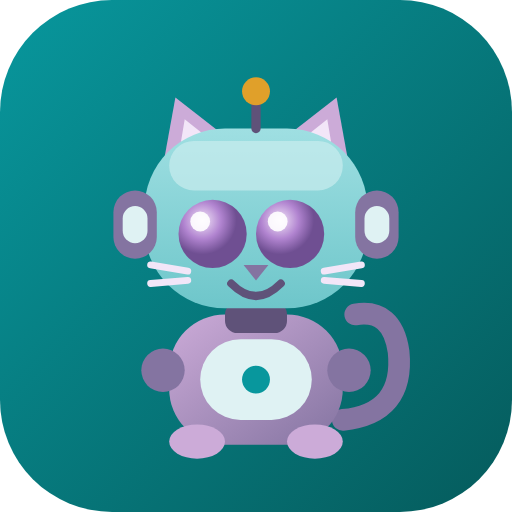

# Byte Quest: GCSE Computer Science

A revision app for the **OCR GCSE Computer Science (J277)** specification, built as an immersive
dungeon adventure and packaged for the Google Play Store.

Byte, a robot cat, guides the student through the Silicon Dungeon, throws fun facts, and marks
their work.



## What is in it

### The dungeon
Every specification topic is a floor. Every floor contains study rooms (lessons), two guardian
rooms (quizzes) and a boss room (past paper style questions). Clearing rooms earns XP and data
shards, which raise the player level and rank from Rusty Whisker to Grand Architect. A daily
streak is tracked automatically.

### Content coverage

| Floor | Topic | Paper |
|---|---|---|
| 1.1 | Systems Architecture | Paper 1 |
| 1.2 | Memory and Storage | Paper 1 |
| 1.3 | Networks, Connections and Protocols | Paper 1 |
| 1.4 | Network Security | Paper 1 |
| 1.5 | Systems Software | Paper 1 |
| 1.6 | Ethical, Legal, Cultural and Environmental Impacts | Paper 1 |
| 2.1 | Algorithms | Paper 2 |
| 2.2 | Programming Fundamentals | Paper 2 |
| 2.3 | Producing Robust Programs | Paper 2 |
| 2.4 | Boolean Logic | Paper 2 |
| 2.5 | Programming Languages and IDEs | Paper 2 |
| PY | Python Practice Unit | Skills |
| ERL | OCR Exam Reference Language | Skills |

Every topic ends with **two quizzes of ten questions each**, then **five past paper style
questions that are marked automatically** against a keyword based mark scheme, with a model
answer and an examiner tip for each one.

Explanations are written to be explicit rather than terse. Each one includes worked examples,
real life scenarios and diagrams.

### Mock exam papers
Six full papers, three for each component, each one timed and marked automatically:

| Paper | Focus | Marks |
|---|---|---|
| Paper 1 Mock A | Systems architecture, memory, storage, data representation | 48 |
| Paper 1 Mock B | Networks, connections, protocols, layers, security | 48 |
| Paper 1 Mock C | Full component mix including systems software and impacts | 44 |
| Paper 2 Mock A | Computational thinking, searching, sorting, logic | 47 |
| Paper 2 Mock B | Programming, strings, arrays, files, SQL, testing | 48 |
| Paper 2 Mock C | Full component mix including languages, IDEs and ERL | 47 |

Each paper opens with a briefing card, runs a countdown timer that hands the paper in
automatically when it expires, has a question grid for jumping around, and finishes with a
section by section breakdown plus every mark scheme and model answer.

### Interactive presentations
Twelve hands on labs, all built as inline SVG and React so they work offline:

- Six animated explainer scenes with narration captions, chapters and a scrub bar
- Fetch decode execute cycle, stepping through a real three instruction program register by register
- Binary and hex lab: bit flipping, hex nibbles, binary addition with overflow detection, binary shifts
- Sound representation: sample rate, bit depth and duration sliders with live file size maths
- Image representation: a pixel grid you can draw on, colour depth switching and file size maths
- Network layers: the four layer TCP IP model, sending and receiving
- Algorithm visualiser: bubble, insertion and merge sort, linear and binary search, step by step
- Logic gate simulator with live truth tables
- Characters and ASCII: type text and watch it become denary, binary and hex
- Trace table trainer, marked instantly
- Python output drill
- OCR Exam Reference Language output drill

### Animated explainer scenes
Six short scenes that behave like videos but are drawn live rather than played from a file:
how a web page reaches your phone, inside the processor, sound becomes numbers, a picture becomes
bits, bubble sort in motion, and wrapping a message in layers. Each has a play and pause bar, a
draggable scrubber, chapter buttons and narration captions.

Briefs for producing filmed or AI generated versions of the same six scenes are in
[`docs/video-briefs.md`](docs/video-briefs.md).

### Design notes
- **No emoji anywhere.** Every icon is a hand drawn SVG glyph in `src/components/Icon.tsx`, built
  on one 24 unit grid with a 1.7 unit stroke and rounded caps, inheriting colour through
  `currentColor`. Nothing is fetched at runtime and there are no icon font dependencies.
- **Custom load screen** with a boot sequence, an animated castle outline, the mascot and a
  progress bar, which then fades into the dungeon.
- **Motion system** in `src/theme.css`: page transitions that slide forward and back, staggered
  list entrances, pressable cards, an animated XP counter, confetti on a perfect quiz or a strong
  paper, and a level up banner. All of it is disabled under `prefers-reduced-motion`.
- Light theme only. There is no dark mode, by request, and the Android theme forces light too.
- Palette: `#CCABD8`, `#8474A1`, `#6EC6CA`, `#08979D`, `#055B5C`.
- No em dashes anywhere in the content.
- Progress is stored in `localStorage` on the device. Nothing is uploaded and no account is needed.

## Running it locally

```bash
npm install
npm run dev        # development server
npm run build      # production build into dist/
npm run preview    # preview the production build
npm run audit      # check the specification content for mistakes
```

### The content audit

`npm run audit` checks the content data rather than the interface. It fails the build if it finds
duplicate ids, a quiz answer index pointing outside its options, an exam question with fewer mark
points than marks, a lesson referencing a diagram or lab that does not exist, a table row that
does not match its header, a paper whose declared total does not match its questions, or an em
dash anywhere in the content. It prints a summary of everything it counted, so it doubles as a
quick inventory.

## Building the Android app for Google Play

The web app is wrapped with [Capacitor](https://capacitorjs.com), so the Android project lives in
`android/`.

```bash
npm run cap:sync   # build the web app and copy it into the Android project
npm run cap:open   # open the project in Android Studio
```

Then, to produce a release for the Play Store:

1. In Android Studio choose **Build > Generate Signed Bundle / APK**, pick **Android App Bundle**.
2. Create or select an upload keystore. Keep the keystore and its passwords safe, because Google
   Play will only accept future updates signed with the same key.
3. Set the version in `android/app/build.gradle` before each release:
   - `versionCode` must increase by at least one every upload.
   - `versionName` is the version students see, for example `1.0.1`.
4. Upload the generated `.aab` to the Play Console.

Alternatively, from the command line with a configured keystore:

```bash
npm run cap:sync
cd android && ./gradlew bundleRelease
```

### Play Console assets
- App icon 512 x 512: `assets/play-store-icon-512.png`
- Splash and feature preview: `assets/play-store-feature-preview.png`
- Source artwork: `assets/icon.svg`, `assets/icon-foreground.svg`, `assets/splash.svg`

### Suggested store listing

**Title:** Byte Quest: GCSE Computer Science

**Short description:** Revise the full OCR J277 GCSE Computer Science course as a dungeon
adventure, guided by a robot cat.

**Full description:**
Byte Quest turns the whole OCR GCSE Computer Science specification into a dungeon crawl. Every
topic is a floor, every lesson is a room, and every quiz is a guardian standing between you and
the boss fight.

Inside you get clear explanations written in plain English, with real life examples for every
idea, diagrams that show what is actually happening, twelve interactive labs including six
animated explainer scenes, a full Python practice unit, a guide to OCR Exam Reference Language,
twenty six quizzes, sixty five past paper style questions, and six full timed mock exam papers
that all mark themselves and show you the mark scheme.

Byte the robot cat travels with you and throws a fun fact whenever you least expect it.

Everything works offline. There are no accounts, no adverts and no data collection. Progress is
saved on the device.

### Data safety declaration
The app collects no personal data, requires no permissions beyond the default, has no network
calls at runtime, and stores progress only in the device browser storage used by the WebView.

## Project structure

```
src/
  content/topics/   one file per specification topic, lessons, quizzes and exam questions
  content/papers/   the six timed mock exam papers
  content/facts.ts  the fun facts Byte throws
  diagrams/         static SVG diagrams referenced by lesson blocks
  presentations/    the interactive labs
  components/       block renderer, quiz runner, exam runner, paper runner, icons, mascot,
                    load screen and celebration effects
  screens/          dungeon map, topic, lesson, papers, labs, facts, progress
  game/store.ts     XP, levels, ranks, streaks, saving
  types.ts          the content model
android/            the Capacitor Android project
assets/             icon and splash artwork
docs/               video briefs for filmed versions of the animated scenes
```

## Adding a new topic

1. Create `src/content/topics/your-topic.ts` exporting a `Topic`.
2. Add it to the array in `src/content/topics/index.ts`.
3. Reference any diagram by its id from `src/diagrams/index.tsx` and any lab by its id from
   `src/presentations/index.tsx`.

The auto marker awards one mark per mark point. A mark point is awarded when any of its `accept`
groups matches, and every keyword within a group must appear in the student answer.
